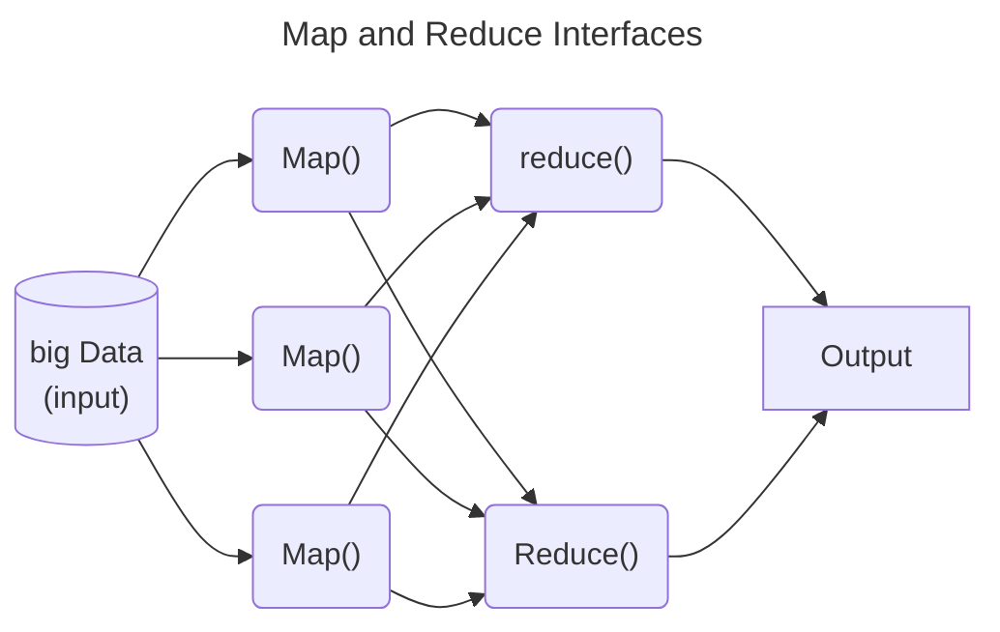

>"Suppose we are living in 100% data world. Then 90% of the data is produced in the last 2 to 4 years. This is because now when a child is born, before her mother, she first faces the flash of the camera"

*GeeksforGeeks article*

Hadoop is a *java based* framework of the open source set of tools used to manage, store and process data for big data appliations running under a clustered system. 

- It is the de facto standard for most big data storage and processing
>[!note] once data is written to Hadoop it is *immutable*

# Components of Hadoop

## HDFS
- stands for the *Hadoop Distributed File System*
- designed to run on commodity software
- highly fault tolerant
- designed to be deployed on low cost hardware
- high throughput access to application data for applications that have large data sets. 
- originally built as infrastructure for the Apache Nutch web Search engine project.
- [Project URL](https://hadoop.apache.org/hdfs/).

## MapReduce
- if HDFS is responsible for *storing* the file, MapReduce is the second component which is responsible for processing the file
- MapReduce has mainly 2 tasks which are divided into the *map* and *reduce* phase

## YARN
- stands for *Yet another Resource Negotiator*
- dedicated operating system for Hadoop which manages cluster resources. 
	- also functions as a job scheduling framework for Hadoop

The types of scheduling available using YARN are:
- First come first server
	- This is the YARN default
- Fair share scheduler
- Capacity scheduler