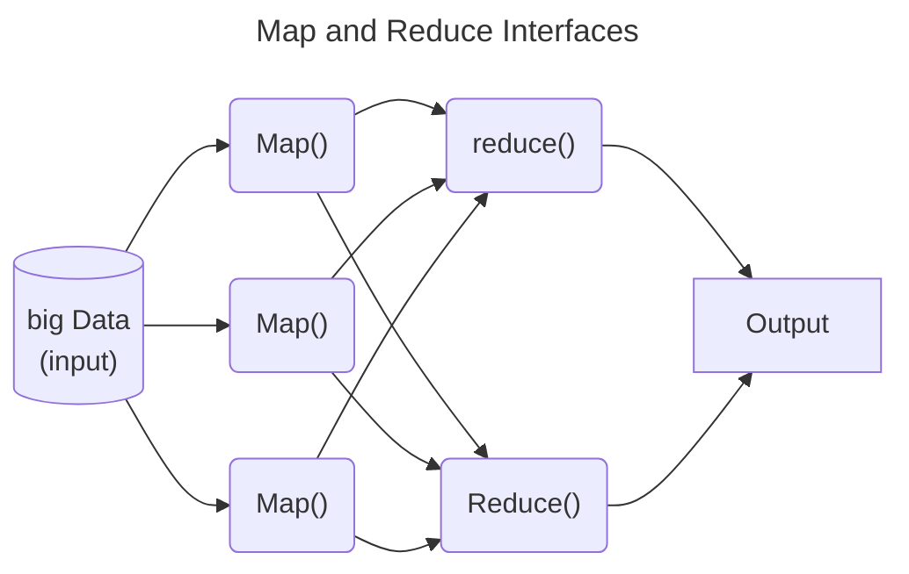

>"Suppose we are living in 100% data world. Then 90% of the data is produced in the last 2 to 4 years. This is because now when a child is born, before her mother, she first faces the flash of the camera"

*GeeksforGeeks article*

Hadoop is a *java based* framework of the open source set of tools used to manage, store and process data for big data appliations running under a clustered system. 

- It is the de facto standard for most big data storage and processing
>[!note] once data is written to Hadoop it is *immutable*

## 5 V's of big data

1. **Volume:** Data is being produced in large volumes.
2. **Velocity:** Huge amounts of data is generated per second.
> [!info] It is estimated that by the end of 2020, every individual will produce 3mb data per second. 
4. **Variety:** The data being produced by different means is of three types: 
    - **Structured Data:** It is the relational data which is stored in the form of rows and columns.
    - **Unstructured Data:** Texts, pictures, videos etc. are the examples of unstructured data which can’t be stored in the form of rows and columns.
    - **Semi Structured Data:** Log files are the examples of this type of data.
5. **Veracity:** Inconsistent or incomplete data which results in the generation of doubtful or uncertain Information.
6. **Value:**  Data in itself is of no use or importance but it needs to be converted into something valuable to extract Information.

# HDFS
- stands for the *Hadoop Distributed File System*
- designed to run on commodity software
- highly fault tolerant
- designed to be deployed on low cost hardware
- high throughput access to application data for applications that have large data sets. 
- originally built as infrastructure for the Apache Nutch web Search engine project.
- [Project URL](https://hadoop.apache.org/hdfs/).
# MapReduce
- if HDFS is responsible for *storing* the file, MapReduce is the second component which is responsible for processing the file
- MapReduce has mainly 2 tasks which are divided into the *map* and *reduce* phase

# YARN
- stands for *Yet another Resource Negotiator*