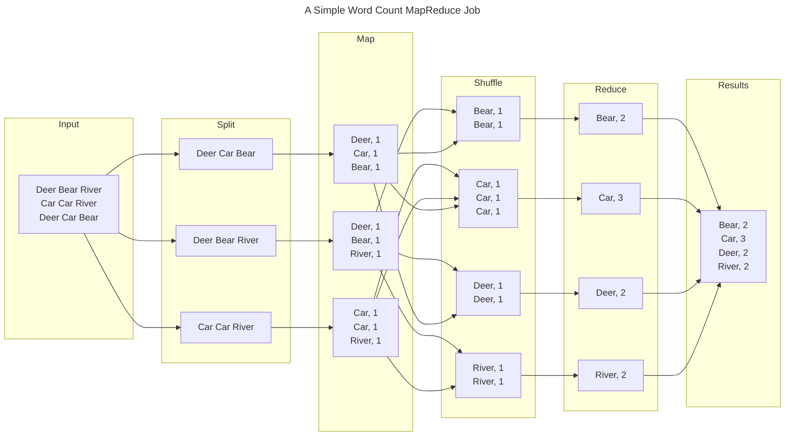

open source by google!![[Pasted image 20250114105812.png]]

- its an api or a set of libraries runnbale on commodity hardware
	- cheap 
	- able to do mass computation
- job - unit o fmapreduce work instnace
- map task -  runs on each worker node
- reduce task - runs on some worker nodes
- input data

MAP

executes the map() function on each node
outputs <key, value> pairs on each node


REDUCE
executes the reduce() function on some nodes
	this is key for optimization
aggregated sets of key, value  pairs on some nodes 
outputs a combines list 

> [!tip]- Some MapReduce Pseudocode
>
>```Java
>public class MapReduce {
>	Public static void Main(String[] args)
>	{
>		//create JobrunnerInstance
>		//call MapInstance on obInstance
>		//call ReduceInstance on JobInstance
>	}
>	public static void Map()
>	{
>		//write Mapper
>	}
>	public static void Reduce()
>	{
>		//write Reduceer
>	}
>} 
>```


HelloWorld equivelant example for mapreduce 
"word count" function
takes some text as input
produces a list of words and counts them
**key area** what is a word - consider for optimization and key when thinking about mapreduce 

word count example diagram 

MAPREDUCE job output 
"success" to console
series of txt files
immutable if stored in hdfs
each run requires new file name
usually appends runtime to file name

DAEMONS and servoces for MapReduce
- JVMS or services - isolated processes which alllows for scalablility
	- job trakcer - one (controller and scheduler)
	- task tracker - one per cluser (mniter tasks)
- job configurations
	- speecify i/o locations for job instances
	- job clients submit jobs for execuction

MR job status and logs
- monitor job run ststus
- local websites
- logs
- troubleshooting failed job runs
- err logs (standard out and standard err logs)