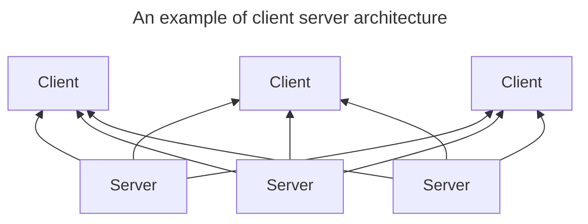
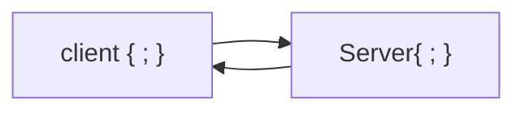
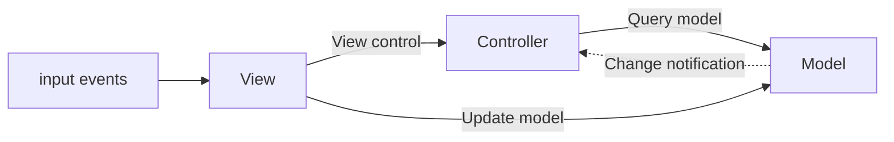
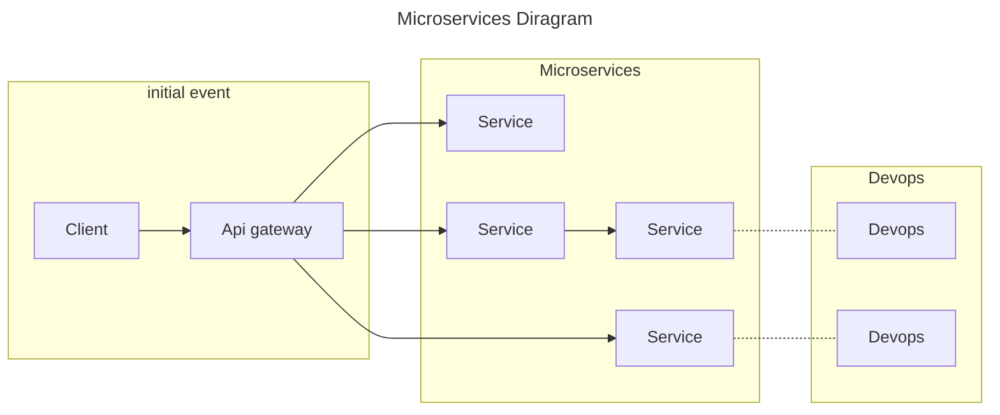
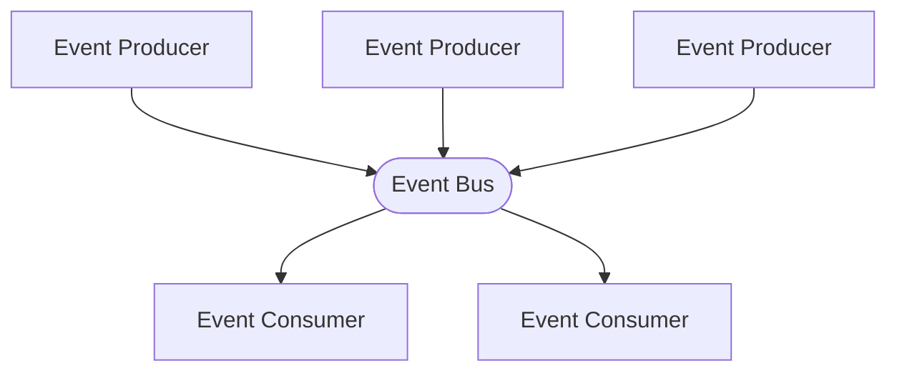

# Common Architecture Patterns
## Client-Server
### what are client side and server side

### what is the client server model
much of the web is based on this model. end user devices (machines are considered to be clients of the server. client devices send requests to servers for webpages or applications and the servers serve up responses. 
used because servers are typically more powerful and reliable than user devices.

### what does client side mean?
everything in a web app that is displayed or takes place on the client side end user device
also known as the frontend. client side refers soley to the location where processes run while frontend refers to the kinds of processes that rin client side

### what does server side mean?

much like client side: anything that happens on the server. in the past nearly all business logic ran server side. 

the problem with hosting all these processes server side is that each request must go all the way from client to server, every time. thos creates latency. nowadays more applications run more on the client, such as rendering dynamic web pages.

also known as backend although backend revers soley to the location where the processes run

### what is client side scripting?
client side scripts mean running scripts such as JavaScript on the client device, usually within the browser.
server side scripts run on the server rather than the client often in order to deliver dynamic content.

scripts run client side and server side

## Peer-to-Peer
## Model-view-Controller (MVC)

architecture for WWW apps in major programmin glangs
web frames such as django and rails

## Micro-Services
collection of small autonomous services. each service is self contained and should implement a single busuness capability withoun a bounded context. a bounded contect is a natural division within a business and provides and explicit boundary within

## Event Driving
event based architecture is a design that uses the production and consumtion of events to control behavior

often very applcaiable to specific dev such as:
- event driven apps
	- ?UIs
	- Hardware evnts
- distributed apps

## Layered
used to structure programs that can be decomposed into groups of subtaks. each layer provides services to the next, higher layer. 