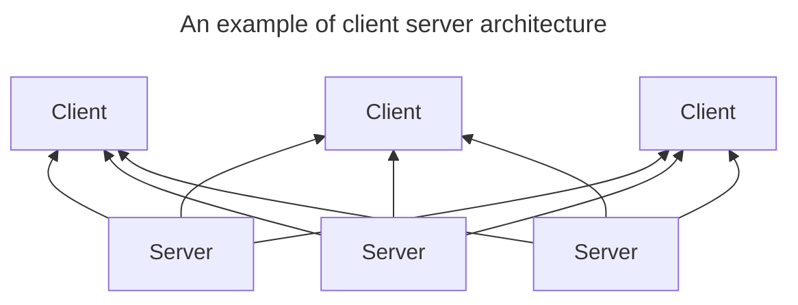
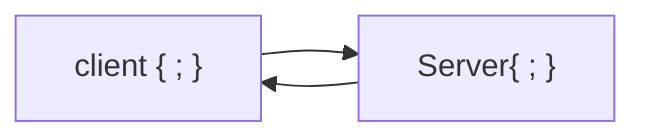
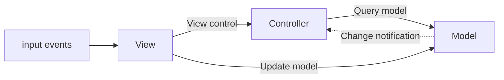
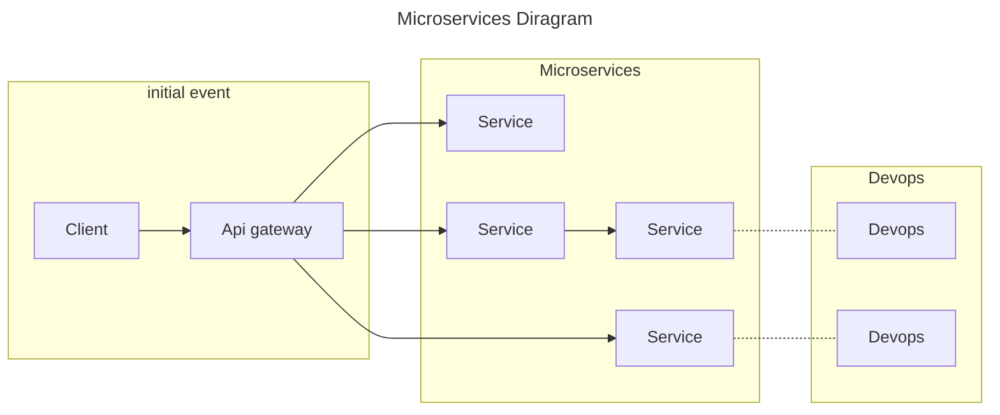
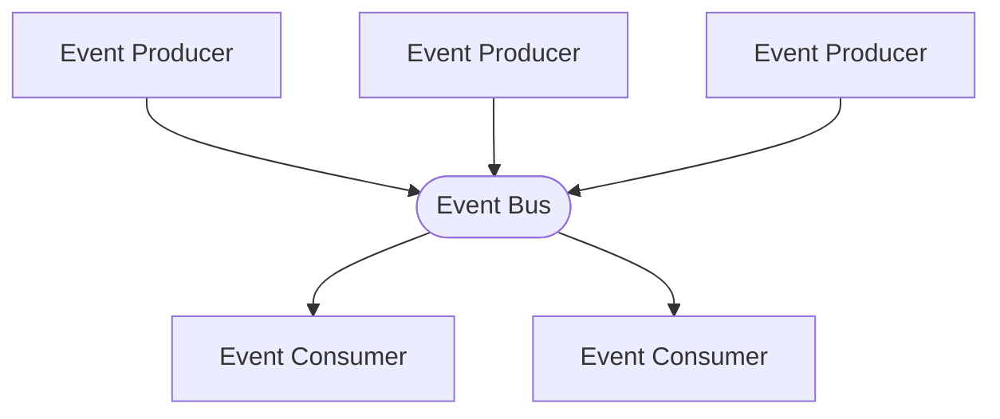
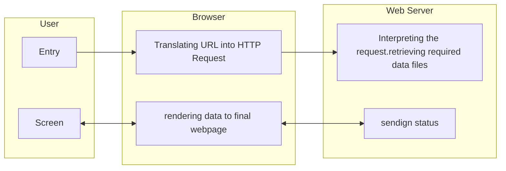
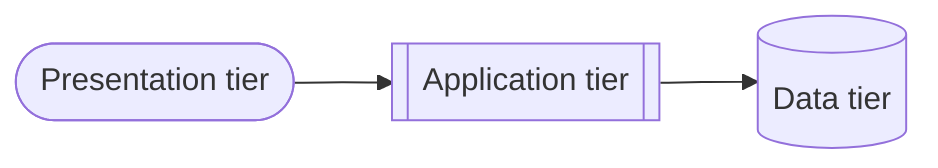

## Course Resource:
the resource that we will primarily use for this course is: [The Jakarta® EE Tutorial](https://eclipse-ee4j.github.io/jakartaee-tutorial/)

> [!note] the examples covered in the resource use Eclipse IDE, we will make any relevant changed and use IntelliJ environment.
# Web Programming Architectures:

> Broad objectives for unit 1
1. client side technologies
2. server side technologies
3. explore popular java frameworks
4. Analyze common software architecture patterns
5. explaon the flow of information to an from a server in a simple http doc
6. differentiate between web services, apis and microservices
7. illustrate multi tier archtectures
8. discuss db integrations within java
9. ecplain how jakarta EE facilitates integration fo java components with non java systems
10. describe java web applications and their components

## 1.1 and 1.2 client and server side technologies

> “Any application that can be written in JavaScript, will eventually be written in JavaScript”

[_Jeff Atwood, Co-Founder of Stack Overflow_](https://blog.codinghorror.com/the-principle-of-least-power/)

### Definitions
**HTML**
To understand "HTML" from front to back, let's look at each word that makes up the abbreviation:
- **Hypertext**: text (often with embeds such as images, too) that is organized in order to connect related items
- **Markup**: a style guide for typesetting anything to be printed in hardcopy or soft copy format
- **Language**: a language that a computer system understands and uses to interpret commands.

**css  (cascading style sheets)**
a style sheet language used to describe the presentation of a document written in HTML or XML.
javascript: a powerful and flexible programming language for the web that is widely used to make websites interactive and dynamic.

**HTTP (Hypertext Transfer Protocol)**
is a fundamental protocol of the Internet, enabling the transfer of data between a client and a server. It is the foundation of data communication for the World Wide Web.

## what are client side and server side

### what is the client server model
much of the web is based on this model. end user devices (machines are considered to be clients of the server. client devices send requests to servers for webpages or applications and the servers serve up responses. 
used because servers are typically more powerful and reliable than user devices.

### what does client side mean?
everything in a web app that is displayed or takes place on the client side end user device
also known as the frontend. client side refers soley to the location where processes run while frontend refers to the kinds of processes that rin client side

### what does server side mean?

much like client side: anything that happens on the server. in the past nearly all business logic ran server side. 

the problem with hosting all these processes server side is that each request must go all the way from client to server, every time. thos creates latency. nowadays more applications run more on the client, such as rendering dynamic web pages.

also known as backend although backend revers soley to the location where the processes run

### what is client side scripting?
client side scripts mean running scripts such as JavaScript on the client device, usually within the browser.
server side scripts run on the server rather than the client often in order to deliver dynamic content.

scripts run client side and server side

### server side technologies 
**Java**
**Jakarta Server Pages** - an extension of the java servlet tech
**Servlets**  - platform independent, 100% pure java that fit seamlessly into web server framework. involves no platform-specific consideration
### java persistence API
data persistence is a means for an app to persist and retrieve info from a non volatile storage system, vital to enterprise apps. 
more info [Java Persistence API (JPA) feature overview - IBM Documentation](https://www.ibm.com/docs/en/was-liberty/core?topic=jpa-java-persistence-api-feature-overview)

### java app servers
a application server is a server that hosts applications 

Tomcat and TomEE are the most common servers for Java hosting using the Apache v2 liscence

## 1.3 popular java frameworks
### what are java frameworks
a body of pre- written code acting as a template or a skeleton, which can then be used and reused to create an application by filling code as needed to get an app to work as they intent refers to as a framework. 

### why frameworks
give structure to applications
EX: if we have a proper framework for testing, we can automate a lot of things and get accurate and consistent results. same way if there are frameworks for ORM, web apps, logging, data management, etc. 

### Peer-to-peer
individual components are known as peers. peers function as both a client and a server 

### MVC
architecture for WWW apps in major programmin glangs
web frames such as django and rails

### micro services
collection of small autonomous services. each service is self contained and should implement a single busuness capability withoun a bounded context. a bounded contect is a natural division within a business and provides and explicit boundary within

### event driving

event based architecture is a design that uses the production and consumtion of events to control behavior

often very applcaiable to specific dev such as:
- event driven apps
	- ?UIs
	- Hardware evnts
- distributed apps

### Layered
used to structure programs that can be decomposed into groups of subtaks. each layer provides services to the next, higher layer. 
## 1.5 flow of info to and from a server related to HTTP
when is HTTP used? 
HTTP *was** only used to request an html doc from a web server, today the protocal does many things
![[Pasted image 20250113132308.png]]
![[Pasted image 20250113132324.png]]

## 1.6 differenciate between web services, apis and microservices 
### what is a web api
stands for applicaiton programming interface. this allows people tio further build upon another applications functionality and data

types of webapi
- composite: merge service and data apis
- partner require liscense or special rights
- open bear no access restrictions and can be accessed by public
- internal operate as private apis witihn an internal system

what is a web service
contrasted to api functions more like a resource thats available using the internet
a;; web services are apis but only some apis are web services

works by supporting interoperable machine to machine comms using a networok they tend to be connected with SOA or service oriented architecture.
allows for different features to be seperated then made available as various services within a network

what is web service testing?

typyes of web services
- .net framework
- apache axis
- ws02
- xml interface for network servcies
- ![[Pasted image 20250113133543.png]]

web api bs web service ,what s the diff

web services require a network to function apis can function online or offline
web services are not protocol agnostic. apis can use any design style or protocolm web servises are restricted mostly to SOAP or simple object access protocol

web services sacrifice transparency for more specific data, partners, and security. however api security remains a challenge

what is a REST api or other web services API 
rest stands for REpresental state transfer and allows for standards among web based comp systems. these RESTful systems facilitate comms between systems more easilt

differenct between SOAP vs REST.

|SOAP |REST |
|---|---|
|protocal|architecure|
|function driven | data driven|
| Requires advanced security, but can define it too |relies on underlying network which can be less secure|
|needs more bandwidth | only needs minimum bandwidth|
|Stricter Rules to follow|easier for devs to suggest recommendations|
| Cannot user REST | Can use SOAP |
| Only works in XML | works in different data formats such as HTML, JSON, XML and plain text |
| Supports HTTP and SMTP protocols | only requires HTTP |

what is a microservice

1.7 illisutration of multi-tiered architecture
main benifit is each tier runs on its own infastructure

