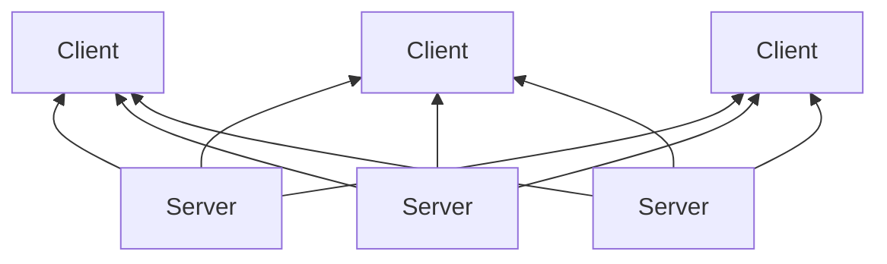
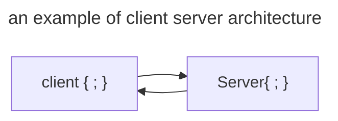

## Course Resource:
the resource that we will primarily use for this course is: [The Jakarta® EE Tutorial](https://eclipse-ee4j.github.io/jakartaee-tutorial/)

> [!note] the examples covered in the resource use Eclipse IDE, we will make any relevant changed and use IntelliJ environment.
# Web Programming Architectures:

> Broad objectives for unit 1
1. client side technologies
2. server side technologies
3. explore popular java frameworks
4. Analyze common software architecture patterns
5. explaon the flow of information to an from a server in a simple http doc
6. differentiate between web services, apis and microservices
7. illustrate multi tier archtectures
8. discuss db integrations within java
9. ecplain how jakarta EE facilitates integration fo java components with non java systems
10. describe java web applications and their components

## 1.1 and 1.2 client and server side technologies

> “Any application that can be written in JavaScript, will eventually be written in JavaScript”

[_Jeff Atwood, Co-Founder of Stack Overflow_](https://blog.codinghorror.com/the-principle-of-least-power/)

### Definitions
**HTML**
To understand "HTML" from front to back, let's look at each word that makes up the abbreviation:
- **Hypertext**: text (often with embeds such as images, too) that is organized in order to connect related items
- **Markup**: a style guide for typesetting anything to be printed in hardcopy or soft copy format
- **Language**: a language that a computer system understands and uses to interpret commands.

**css  (cascading style sheets)**
a style sheet language used to describe the presentation of a document written in HTML or XML.
javascript: a powerful and flexible programming language for the web that is widely used to make websites interactive and dynamic.

**HTTP (Hypertext Transfer Protocol)**
is a fundamental protocol of the Internet, enabling the transfer of data between a client and a server. It is the foundation of data communication for the World Wide Web.

## what are client side and server side

### what is the client server model
much of the web is based on this model. end user devices (machines are considered to be clients of the server. client devices send requests to servers for webpages or applications and the servers serve up responses. 
userd because servers are typically more powerful and reliable than user devices.

eud = end user device
### what does client side mean?
everything in a web app that is displayed or takes place on the client side (eud)
also known as the frontend. client side refers soley to the location where processes run while frontend refers to the kinds of processes that rin client side

### what does server side mean?

much like client side: anything that happens on the server. in the past nearly all business logic ran server side. 

the problem with hosting all these processes server side is that each request must go all the way from client to server, every time. thos creates latency. nowadays more applications run more on the client, such as rendering dynamic web pages.

also known as backend although backend revers soley to the location where the processes run

### what is client side scripting?
client side scripts mean running scripts such as JavaScript on the client device, usually within the browser.
server side scripts run on the server rather than the client often in order to deliver dynamic content.

scripts run client side and server side

server side technologies 
java
jakarta server pages - an extension of the java servlet tech
servlets  - platform idependant, 100% pure java that fit seamlessly into web server framework. invlove no platform-specific consideration
java persistence API
data persistence is a means for an app to persist and retrieve info from a non volatile storage system, vital to enterprise apps. 
more info [Java Persistence API (JPA) feature overview - IBM Documentation](https://www.ibm.com/docs/en/was-liberty/core?topic=jpa-java-persistence-api-feature-overview)

java app servers
a applcaiton server is a server that hosts applications 

tomcat and tomEE are tge most common servers for java hosting using the apache v2 liscence

1.3 popular java frameworks
what are java frameworks
a body of pre- written code acting as a template or a skeleton, which can then be used and reused to create an application by filling code as needed to get an app to work as they intent refers to as a framework. 

why frameworks
give structure to applications
EX: if we have a proper framework for testing, we can automate a lot of things and get accurate and consistent results. same way if there are frameworks for ORM, web apps, logging, data management, etc. 